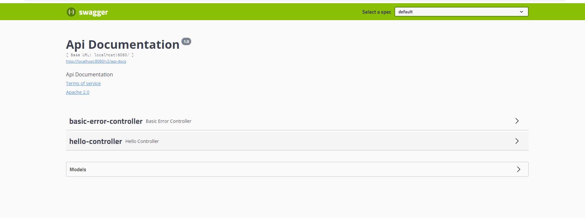
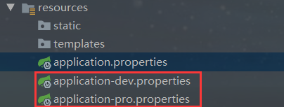

# Swagger


**前后端分离**

Vue + SpringBoot
后端**时代**：前端只用管理静态页面；html ⇒ 后端。模板引擎JSP ⇒ 后端是主力。

前后端分离时代：

- 后端：后端控制层，服务层，数据访问层【后端团队】
- 前端：前端控制层，视图层【前端团队】
  - 伪造后端数据，json。已经存在了，不需要后端，前端工程依旧能够跑起来。
- 前后端如何交互？ ===> API
- 前后端相对独立，松耦合；
- 前后端甚至可以部署在不同的服务器上；

产生一个问题：

- 前后端集成联调，前端人员无法和后端人员无法做到，“即时协商，尽早解决”，最终导致问题集中爆发；

解决方案：

- 首先指定schema[计划的提纲]，实时更新最新API，降低集成的风险；
- 早些年：指定word计划文档；
- 前后端分离：
  - 前端测试后端接口：postman
  - 后端提供接口，需要实时更新最新的消息及改动！


## 简介：

- 号称世界上最流行的Api框架
- RestFul Api文档在线自动生成工具==>api文档与Api

官网：https://swagger.io/

在项目中使用swagger需要springbox；

- swagger2
- ui

## SpringBoot集成Swagger

1. 新建一个SpringBoot - web项目

2. 导入相关依赖

3. ```properties
   <!-- https://mvnrepository.com/artifact/io.springfox/springfox-swagger2 -->
   <dependency>
       <groupId>io.springfox</groupId>
       <artifactId>springfox-swagger2</artifactId>
       <version>2.9.2</version>
   </dependency>
   <!-- https://mvnrepository.com/artifact/io.springfox/springfox-swagger-ui -->
   <dependency>
       <groupId>io.springfox</groupId>
       <artifactId>springfox-swagger-ui</artifactId>
       <version>2.9.2</version>
   </dependency>
   ```

4. 编写一个Hello工程

5. 配置Swagger ==> Config

6. ```java
   package com.kuang.swagger.config;
   
   import org.springframework.context.annotation.Configuration;
   import springfox.documentation.swagger2.annotations.EnableSwagger2;
   
   @Configuration
   @EnableSwagger2   // 开启Swagger2
   public class SwaggerConfig {
   
       
   }
   
   ```

7. 测试运行 http://localhost:8080/swagger-ui.html

8. 

## 配置Swagger


swagger的bean实例Docket；（在上面SwaggerConfig 类中添加）

```java

@Configuration
@EnableSwagger2
public class SwaggerConfig {

    //配置了swagger的Docket 的 bean 实例
    @Bean
    public Docket docket(){
        return new Docket(DocumentationType.SWAGGER_2);
    }

    //配置 swagger 信息 = apiInfo
    private ApiInfo apiInfo(){
        Contact contact = new Contact("Simple","Simple's URl","2419316154@qq.com");
        return new ApiInfo("Simple‘s Swagger Documentation",
                "自定义 Swagger Api Documentation",
                "1.0",
                "urn:tos",
                contact,
                "Apache 2.0",
                "http://www.apache.org/licenses/LICENSE-2.0",
                new ArrayList());
    }
}
```

## Swagger配置扫描接口

```java
    //配置了swagger的Docket 的 bean 实例
    @Bean
    public Docket docket(){
        return new Docket(DocumentationType.SWAGGER_2)
                .apiInfo(apiInfo())
                .select()
                // RequestHandlerSelectors, 配置要扫描的包
                // basePackage(): 指定要扫描的包
                // any(): 扫描全部
                // none(): 都不扫描
                // withClassAnnotation : 扫描类上的注解, 参数是一个注解的反射对象
                // 例如：withClassAnnotation(RestController.class) 只扫描类上有@RestController的生成文档
                // withMethodAnnotation: 扫描方法上的注解, 参数是一个注解的反射对象
                .apis(RequestHandlerSelectors.basePackage("com.simple.swaggerlearn.controller"))
                // paths(): 过滤什么路径
                //.paths(PathSelectors.ant("/simeple/**"))
                .build()
                ;
    }
```

配置是否启动Swagger（**enable 是否启动Swagger， 如果为false， 则Swagger 不能再浏览器中访问**）

```jade
.enable(true)
```


问题：我只希望我的Swagger在生产环境中使用，在发布的时候不使用？
解题思路：

- 判断是不是生产环境 flag = false
- 注入enable(flag)

解题步骤：
1.先在resources目录下创建两个properties文件，如下图



接下来在application.properties文件中激活环境

```properties
spring.profiles.active=dev
```

接着上面的docket()，在方法中加入形参Environment获取application.properties中的设置的环境

```java
    @Bean
    public Docket docket(Environment environment){

        // 设置要显示的Swagger环境
        Profiles profiles = Profiles.of("dev", "test");
        // 通过 environment.acceptsProfiles(profiles) 判断是否处在自己设定的环境当中
        boolean flag = environment.acceptsProfiles(profiles);
```

## 配置API文档的分组


```java
.groupName("simple")
```


配置多个分组，多个Docket实例即可

```java
 @Bean
 public Docket docket1(){
     return new Docket(DocumentationType.SWAGGER_2).groupName("A");
 }
 @Bean
 public Docket docket2(){
     return new Docket(DocumentationType.SWAGGER_2).groupName("B");
 }
 @Bean
 public Docket docket3(){
     return new Docket(DocumentationType.SWAGGER_2).groupName("C");
 }

```

Swagger中就会出现多个分组


## 总结

1. 我们可以通过Swagger给一些比较比较难理解的属性和接口，增加注释信息
2. 接口文档实时更新
3. 可以在线测试